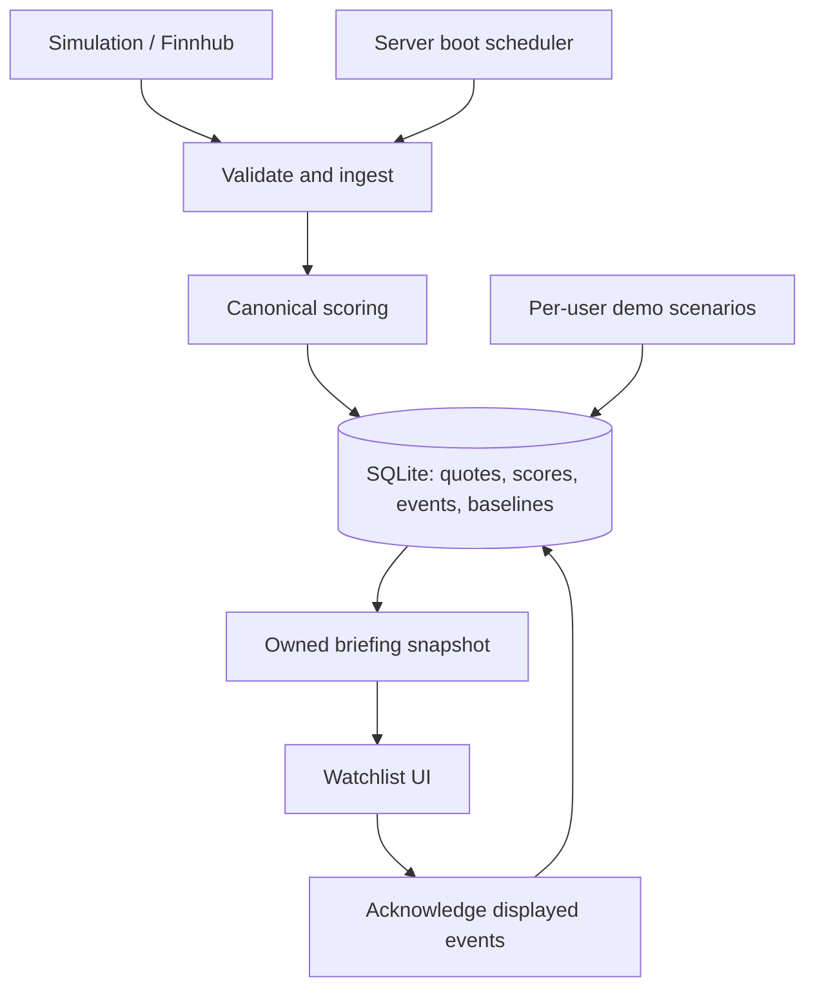

# Smart Market Watchlist

### What changed. What matters.

**We preserve what you missed and explain why it matters.**

Built for **CODE 2026**, Smart Market Watchlist turns a list of stock prices into a personal return briefing: **what meaningfully changed since your last review, what deserves attention, and how reliable is the evidence?**

A stock can jump from **$100 to $108**, then settle at **$101** before you return. A price-only watchlist shows a small net change. Smart Market Watchlist preserves the earlier spike and explains it alongside the latest price.

The return briefing is the core experience. Prices provide the context.

**Next.js · React · TypeScript · SQLite · Finnhub · Node.js test runner**

---

## Contents

- [Why this exists](#why-this-exists)
- [What you can do](#what-you-can-do)
- [Quick start](#quick-start)
- [Try the demo](#try-the-demo)
- [Architecture](#architecture)
- [Defining meaningful change](#defining-meaningful-change)
- [Review semantics](#review-semantics)
- [Data quality and resilience](#data-quality-and-resilience)
- [Testing](#testing)
- [API and code guide](#api-and-code-guide)
- [Deployment and scaling](#deployment-and-scaling)
- [Engineering decisions](#engineering-decisions)
- [Known limitations](#known-limitations)

## Why this exists

Most watchlists are good at showing the current state. Returning users need something more specific: **an explanation of what happened while their attention was elsewhere.**

This project separates three questions:

| Question | What the application shows |
| --- | --- |
| Where is the stock now? | Latest accepted quote, source, and timestamp. |
| How has it changed since I reviewed it? | Current price compared with the user's saved review baseline. |
| What happened in between? | Unread events with preserved evidence, even if the price later reversed. |

The design also treats uncertainty as part of the answer. **“No significant events observed” is different from “nothing happened,” especially when the feed is stale or coverage is incomplete.**

## What you can do

- **Build a watchlist:** add and remove supported stocks, with server-side ownership checks and duplicate protection.
- **Start tracking explicitly:** establish a baseline with “Start tracking from here.”
- **Return to a briefing:** see meaningful events since tracking or your last review, with plain-language explanations.
- **Inspect the evidence:** explore the observed move, score components, source, timestamps, and missing inputs.
- **Review deliberately:** acknowledge displayed changes without dismissing newer events that arrived afterward.
- **See data quality:** distinguish simulated observations, real-provider data, delayed or stale quotes, and unavailable information.
- **Explore without credentials:** run isolated, deterministic market scenarios in demo mode.

Attention scores prioritize inspection. They are not forecasts, probabilities, or buy/sell recommendations.

## Quick start

### Requirements

- A Node.js runtime supporting **`node:sqlite`** and **`--experimental-strip-types`**.
- npm.
- A writable local directory for SQLite.
- A Finnhub API key only if you want to use the real-provider adapter.

Check the two runtime features before installing:

```bash
node --experimental-strip-types -e "require('node:sqlite'); console.log('Runtime ready')"
```

### Run locally

From the application directory containing `package.json`:

```bash
npm install
npm run dev
```

Open [localhost:3000](http://localhost:3000).

No market-data credentials are needed for simulation or demo mode. The application creates `.data/watchlist.sqlite` on startup.

### Configuration

Copy `.env.example` to `.env` if you need custom settings. Keep credentials out of version control.

| Variable | Purpose |
| --- | --- |
| `FINNHUB_KEY` | Enables the Finnhub provider. Leave unset for the zero-key simulation path. |
| `INGEST_SECRET` | Secret for authorized manual ingestion requests. |
| `SW_DATA_DIR` | Overrides the data directory; defaults to `.data` beneath the application directory. |
| `SW_DB_PATH` | Overrides the SQLite file path. |

Example values:

```dotenv
# Optional real market data
FINNHUB_KEY=

# Set a strong private value before enabling manual ingestion
INGEST_SECRET=

# Optional storage overrides
# SW_DATA_DIR=/absolute/path/to/persistent-data
# SW_DB_PATH=/absolute/path/to/persistent-data/watchlist.sqlite
```

Restart the server after changing environment variables. When switching providers, the application resets source-dependent statistics and records the switch so simulated and real observations do not share a statistical baseline.

### Production commands

```bash
npm run build
npm run start
```

Use **one application instance with persistent storage**. See [Deployment and scaling](#deployment-and-scaling) before selecting a hosting environment.

## Try the demo

Demo mode uses a per-user `demo:<uid>` namespace and an owned demo watchlist. It does not modify the ordinary market-data namespace or another user's data.

| Control | Behavior |
| --- | --- |
| **Reset demo** | Establishes flat baselines and tracking with no events. |
| **Advance scenario** | Appends the next scripted observation without deleting earlier evidence. |
| **Inject event now** | Creates a new event for testing acknowledgement behavior. |
| **Exit demo** | Returns to the ordinary watchlist and its configured data mode. |

### Three-minute walkthrough

1. **Open Demo and reset it.** Start with a clean baseline at $100.
2. **Advance once.** The demo instrument rises to $108 and creates a meaningful event.
3. **Advance again.** The price returns to $101. The briefing preserves the spike while the since-review change is approximately +1%.
4. **Inspect the event.** Show the original observation, comparison baseline, score components, and source.
5. **Demonstrate acknowledgement isolation.** Capture the current briefing token and displayed event IDs. Inject a new event from another tab or test client, then acknowledge using the captured token and original IDs. Fetch a fresh briefing: the newly injected event should remain unread.

For step 5, **do not replace the captured token with a newly fetched token** before acknowledging. Otherwise, the test no longer represents an event arriving after the displayed briefing. A test client or the HTTP test harness is useful if browser polling refreshes the view automatically.

The scenario sequence also includes an NVDA event and a quiet tick. Injectable timestamps make scenario tests deterministic.

For a separate resilience walkthrough, interrupt provider availability in a controlled local environment. Previously accepted quotes should remain visible with their real timestamps; they become stale as they age. An immediate failure need not make a still-recent quote stale immediately.

## Architecture

The frontend and backend live in one Next.js application. Shared ingestion owns market observations; user-specific review state determines what each person has seen.



### Ingestion lifecycle

1. The scheduler starts through `src/instrumentation.ts` when the server boots.
2. A shared ingestion cycle runs approximately every 60 seconds, independently of browser visits.
3. The provider returns an observation, which is validated before it affects stored state.
4. The scoring function evaluates it against **prior accepted observations**.
5. The quote, persisted score, baseline update, and any resulting event commit atomically after the provider request completes.
6. The briefing API returns quotes, events, review baselines, and a token from one consistent snapshot.

The UI displays the score saved with that observation. It does not recompute historical evidence using newer statistics.

### Persistence model

| Entity | Responsibility |
| --- | --- |
| Users and device sessions | Associate anonymous browser identity with owned data. |
| Watchlists and memberships | Store followed instruments and when each membership began. |
| Quotes and persisted scores | Retain observations and the results calculated for them. |
| Statistical baselines | Maintain observation-derived return, volume, and range statistics. |
| Events | Preserve significant observations and their original evidence. |
| Reviews and item baselines | Record the comparison point for each user's watchlist. |
| Briefing snapshots | Bind acknowledgement to the information returned in a particular briefing. |
| Reviewed events | Track exactly which events a user has acknowledged. |

SQLite uses WAL mode and `IMMEDIATE` transactions. Unique membership constraints prevent duplicate entries at the database level.

## Defining meaningful change

The **attention score** is a transparent, versioned heuristic from 0 to 100. Version 2 combines four components:

| Component | Maximum | Evidence requirement | Interpretation |
| --- | ---: | --- | --- |
| Price surprise | 40 | At least 5 prior returns and usable return variation | How large is this observation-to-observation move relative to the stock's observed variability? |
| Volume anomaly | 25 | At least 3 usable volume observations | How does reported volume compare with the observed volume baseline? |
| Observed-range event | 20 | At least 5 price observations | Has the price reached an observed range boundary? |
| Trend reversal | 15 | At least 7 closes | Have the short and longer moving-average relationships changed direction? |

The component values sum to the attention score, rounded and capped at 100. The server stores significant events at **55 or above**.

The implementation lives in `src/lib/score.ts`. This function is the source of truth for component formulas and reason codes.

### Statistical scope

Baselines come from accepted ingestion observations, using Welford's online mean/variance calculation for returns and an incremental volume average. They are evaluated **before** incorporating the observation being scored.

These are observation-based statistics accumulated since baseline initialization or reset—not 20-day daily-return statistics or 52-week market ranges. An observed range is the range represented by the statistical baseline; it should not be confused with the raw quote-retention window.

Sampling is approximately once per minute. Provider interruptions widen the interval between accepted observations, so the return series can contain unequal time intervals. The score is therefore a prioritization heuristic, not a time-normalized volatility estimate.

### Missing evidence stays missing

- Missing components contribute **zero without reweighting** the remaining components.
- The UI lists insufficient evidence instead of inventing values.
- Unknown volume remains `null`.
- Session change is available only when the provider supplies a previous close.
- A since-review return uses the user's saved baseline, not the previous polling sample.
- Freshness is a separate data-quality property, not statistical confidence.

For example, a stock without volume data cannot receive volume points. The remaining components are not inflated to compensate.

### Repeated signals

Event fingerprints distinguish reason sets and movement direction. Repeated events for the same condition are suppressed for 60 minutes unless the score escalates by at least 15 points; a direction change creates a different condition.

This reduces repeated alerts while retaining distinct evidence worth reviewing.

## Review semantics

Review state is explicit. Merely opening the application does not dismiss the changes it is supposed to preserve.

### Establishing a baseline

“Start tracking from here” records the starting point. Events from before tracking began are not presented as missed changes. Stock membership timestamps further restrict the events relevant to each item.

### Acknowledging a briefing

The server returns one snapshot containing the displayed quotes, events, baselines, and a review token. Acknowledgement refers to that snapshot and the displayed event IDs.

| Situation | Intended behavior |
| --- | --- |
| An event arrives after the briefing was fetched | It remains unread after that briefing is acknowledged. |
| Only a subset of unread events is displayed | Undisplayed events are not skipped. |
| The same acknowledgement is repeated | Only newly reviewed items count; previous acknowledgements are not duplicated. |
| An older tab acknowledges later | Newer price baselines do not move backward. |
| A stock is removed and re-added | Its baseline starts fresh; an old membership's baseline is not restored. |
| Another user reviews the same stock | Their action does not change your review state. |

Review mutations are transactional. Historical event evidence remains available independently of the latest price.

## Data quality and resilience

### Source and freshness are separate

| Dimension | What it tells the user |
| --- | --- |
| **Source** | Whether an observation came from simulation, the real provider, or an isolated demo. |
| **Freshness** | Whether the observation is recent, delayed, stale, or unavailable. |
| **Coverage** | Whether the application has enough retained observations/events to assess the requested interval. |

A recent simulated quote is still simulated. A configured real provider does not retroactively turn old simulated observations into real market data.

### Failure behavior

- Invalid observations are rejected before they affect market state.
- A provider failure for one symbol does not block successful updates for others.
- Last-known-good prices remain visible with source timestamps.
- Staleness is assessed as observations age.
- Source changes reset statistics to avoid mixing incompatible series.
- Retention warnings describe actual pruning that overlaps the tracking window.

### Retention

| Data | Retention |
| --- | --- |
| Raw quotes | 7 days |
| Events | 30 days |

Raw retention and accumulated statistical baselines serve different purposes. Deleting old quotes does not imply that the statistical baseline is a rolling seven-day model.

### Market calendar

US market hours use an explicitly labelled weekday **9:30 a.m.–4:00 p.m. Eastern Time approximation**. Holidays and early closes are not modeled. Market status should be interpreted alongside quote timestamps and quality, not as proof that data is current.

## Testing

The project includes a **43-test unit and integration suite**, plus separate HTTP ownership/authentication checks.

```bash
# Unit and integration tests
npm test

# HTTP checks require a production build first
npm run build
npm run test:http

# Static checks
npm run lint
npx tsc --noEmit
```

The test count describes the current project suite; it is not a performance benchmark or a substitute for production verification.

The most important behaviors to validate are:

- Canonical scoring and insufficient-evidence handling.
- Ownership boundaries and duplicate membership protection.
- Exact-snapshot acknowledgement, late arrivals, and old-tab behavior.
- Preserved event evidence after a price reversal.
- Quote validation, persistence, and isolated demo state.

When changing the schema, ingestion, or review logic, include regression cases for its failure paths. Live-provider access is a separate integration check and is not established by passing fixture-based tests.

## API and code guide

### Main API surface

Watchlist-specific endpoints resolve ownership on the server. Unknown or inaccessible watchlists return a consistent 404.

| Method | Route | Purpose |
| --- | --- | --- |
| `GET` | `/api/watchlists` | Resolve the default watchlist. |
| `POST` | `/api/watchlists` | Create a watchlist. |
| `GET` | `/api/watchlists/:id` | Retrieve owned watchlist information. |
| `POST` | `/api/watchlists/:id/items` | Add a supported symbol. |
| `DELETE` | `/api/watchlists/:id/items/:symbol` | Remove a symbol. |
| `POST` | `/api/watchlists/:id/tracking/start` | Establish explicit tracking. |
| `GET` | `/api/watchlists/:id/changes` | Retrieve the return briefing and review token. |
| `POST` | `/api/watchlists/:id/mark-seen` | Acknowledge events from a briefing token. |
| `GET` | `/api/symbols/search` | Search supported symbols. |
| `GET` | `/api/symbols/:symbol/history` | Retrieve observation history. |
| `GET` | `/api/ingest` | Inspect ingestion health. |
| `POST` | `/api/ingest` | Request manual ingestion through the authorized path. |
| `POST` | `/api/demo` | Operate the isolated demo flow. |

Review requests use a server-issued token rather than a client-provided replacement baseline. Consult the route implementations for current request/response fields, especially demo actions.

### Where to start reading

| Path | Responsibility |
| --- | --- |
| `src/instrumentation.ts` | Server-start scheduler initialization. |
| `src/app/page.tsx` | Main watchlist experience. |
| `src/app/api/` | Backend route handlers. |
| `src/lib/market.ts` | Provider interface, simulation, Finnhub, and quote validation. |
| `src/lib/score.ts` | Canonical scoring, summaries, and fingerprints. |
| `src/lib/db.ts` | SQLite persistence, baselines, events, and review state. |
| `src/lib/shared.ts` | Shared application and ingestion services. |
| `src/lib/session.ts` | Anonymous identity and market-hours helpers. |
| `src/lib/companies.ts` | Supported company/instrument metadata. |
| `src/lib/format.ts` | Display formatting. |

## Deployment and scaling

### Current deployment model

Run a persistent Node.js server with **one application instance and a durable disk mounted for the SQLite database**. The scheduler starts with the server and continues without an open browser.

An ephemeral filesystem or independently scheduled replicas do not meet this model. Production build success alone does not establish durable storage or scheduler reliability.

Keep backups using a SQLite-consistent method; do not assume copying only an active database file captures every WAL write.

### Growth path

| Pressure | Next change |
| --- | --- |
| Multiple application replicas | Move persistence to PostgreSQL and coordinate ingestion through one worker or distributed ownership. |
| More unique watched instruments | Add provider-aware batching, bounded work queues, and quota-aware scheduling. |
| Heavy latest-quote reads | Introduce a shared latest-quote cache after measuring the bottleneck. |
| Lower update latency | Consider SSE for delivery while preserving the same review semantics. |
| Cross-device use | Add authenticated accounts and a safe anonymous-to-account migration flow. |

PostgreSQL alone would not prevent multiple schedulers from ingesting the same symbols. Storage and worker coordination need to evolve together.

## Engineering decisions

| Decision | Why it fits this project | Trade-off |
| --- | --- | --- |
| Explainable heuristic scoring | Every signal can be traced to observed inputs and component weights. | Weights are product choices, not learned or calibrated predictions. |
| Persist scores with observations | Historical explanations remain reproducible as baselines evolve. | Requires storing evidence and score versions. |
| Explicit review instead of automatic dismissal | Users control when changes become reviewed. | Adds one deliberate action. |
| Immutable events alongside current quotes | A temporary move remains visible after it reverses. | Requires retention and deduplication policies. |
| SQLite and one server | Small operational footprint with transactional state. | Constrains deployment topology and write scaling. |
| Shared periodic ingestion | Avoids a provider request for every visitor refresh. | Introduces polling latency and a long-running process requirement. |
| Anonymous browser identity | Makes the first session useful without signup. | Does not provide cross-device recovery. |
| Isolated deterministic demo | Makes the core behavior reproducible without market hours or credentials. | Does not verify real-provider behavior. |

News sentiment, trading execution, portfolio accounting, and a conversational assistant are deliberately outside the current scope. The engineering effort goes into making the return briefing understandable and dependable.

## Known limitations

- **Finnhub live integration has not been verified in the reported development environment.** A configured key still requires testing against actual provider access and quotas.
- Finnhub's `/quote` integration provides no volume, so volume-based scoring is unavailable for that feed.
- The current deployment supports one persistent server instance.
- Anonymous identity is tied to the browser; cross-device sync and account recovery are deferred.
- Market holidays and early closes are approximated rather than modeled.
- Corporate-action adjustments for splits and dividends are not implemented.
- Observation gaps produce unequal return intervals; the score is not a standardized daily-volatility measure.
- The application cannot recover market events it never observed, and retained history is finite.

These boundaries are part of the design: the application should make clear what it observed, how it interpreted it, and where its evidence ends.

---

**Built for CODE 2026.** A watchlist should help you resume your understanding of the market—not restart it from a grid of prices.
